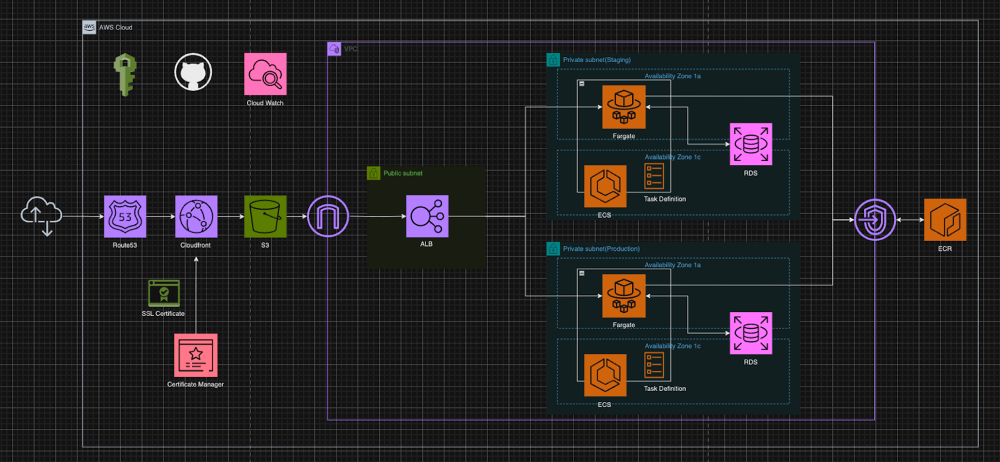

# システムデザイン研究室 AWS環境



## AWS環境構築ドキュメント
https://www.notion.so/AWS-8318f4925dc34b4e951d8abe596b7da4?pvs=4

## 概要
準備中…

## ディレクトリ構成
```
(root directory)
├── README.md        # 本ファイル
├── figure           # 構成図が格納されたディレクトリ
└── terraform        # AWSの環境を定義したファイルが格納されたディレクトリ
    ├── README.md    ### 環境定義について詳しい説明をしたファイル
    ├── apps         ### 各アプリ固有で使用するサービスの定義が格納されたディレクトリ
    └── resources    ### 共通で使用するサービスの定義が格納されたディレクトリ(e.g. ドメイン名定義)
```
